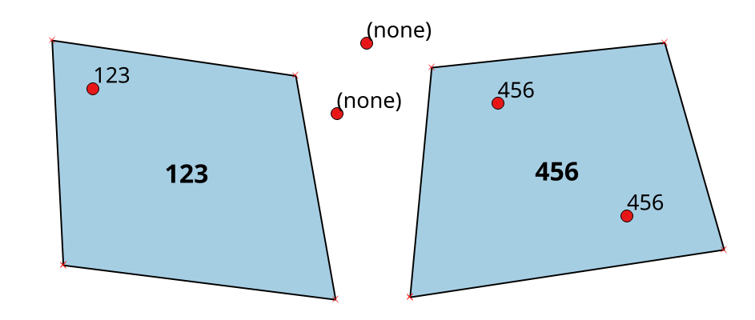
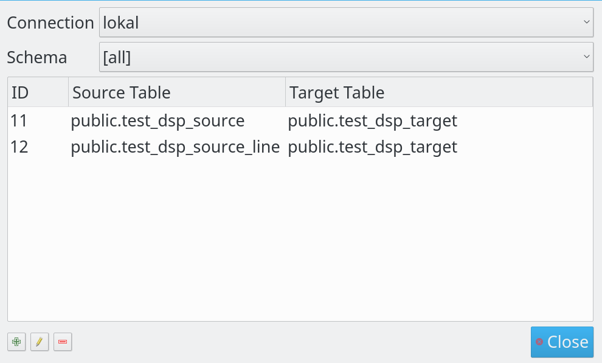
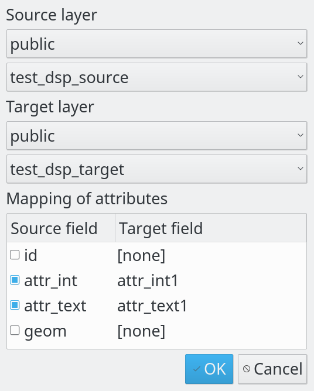

# PostGIS Sampling Tool (QGIS plugin)

Management of triggers in PostGIS database to copy attributes based on spatial relation.

How it works: imagine you have two layers - a polygon layer (**source layer**) and a point layer (**target layer**) - and you want to copy some attributes from the polygon layer to the point layer in case they intersect. See the example:



An integer attribute is copied to points when they happen to be inside one of them (otherwise the attribute is set to NULL).

This plugin can set up triggers in your PostGIS database, so that any time features in source or target layers are added, modified or removed, the attributes in the target layer are updated accordingly.

# Using the plugin

Click plugin's icon in the toolbar to open the configuration dialog:



The dialog will show a list of all triggers between source and target layers created with the plugin and it allows their management (create, update, delete triggers). When creating a new trigger or updating an existing one, the following dialog is shown to set up the trigger configuration:



Once everything is set up, the triggers do their work every time you commit changes to source or target layers - be it within QGIS or in a different PostGIS client.


## Building package

Run ```package.sh``` to generate a ZIP file with the plugin.
